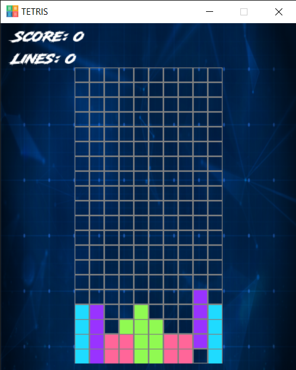
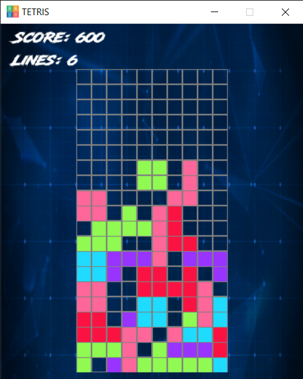
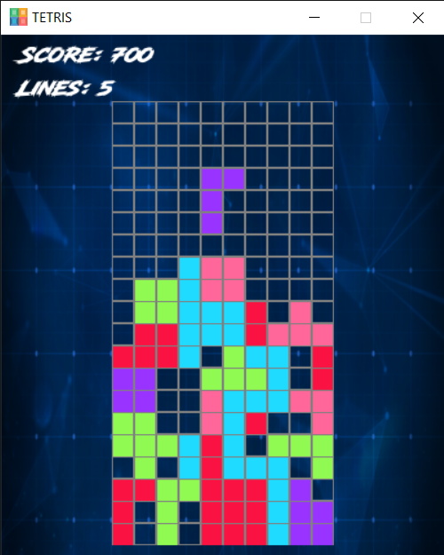
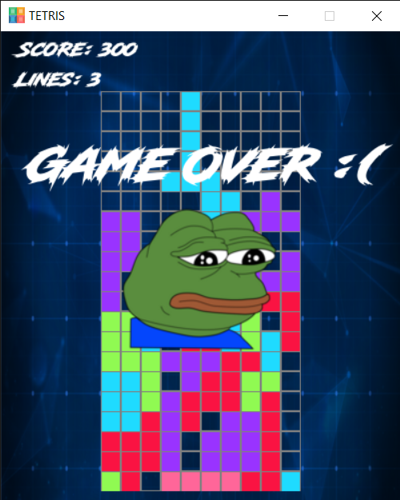

# TETRIS

## Python Implementation of TETRIS Game using Pygame Package
## Requirements 
#### Pygame 2.0+
#### Python 3.6+
#### Pip 20.2+
## Versions Used
#### Pygame 2.0.1
#### Python 3.8.5
#### Pip 20.2.4
## Commands to Check Versions
#### Pygame- `pip show pygame`
#### Python- `python --version`
#### Pip- `pip --version`
## Instructions to Play
#### 1 ) Install Latest Version of Python- [Link](https://www.python.org/downloads/ "python.org")
#### 2 ) Install Pygame- [Tutorial](https://www.pygame.org/wiki/GettingStarted "pygame.org")
#### 3 ) Install GitHub Desktop- [Link](https://desktop.github.com/ "desktop.github.com")
#### 4 ) Clone the [GitHub Respository for TETRIS](https://github.com/pratyush20102/TETRIS "TETRIS")
#### 5 ) Copy the Local Path of the Code `main.py` present in Folder TETRIS in your PC
#### 6 ) Write the command `cd "path"` in Command Prompt where "path" is replaced by the Local Path copied.
#### 7 ) Write the command `main.py` in Command Prompt and play the TETRIS Game !!
## Controls- TETRIS
| **Key Pressed**      |    **Effect**      |
|--------------|---------------|
| LEFT     | Figure moves Leftwards         |
| RIGHT  | Figure moves Rightwards         |
| UP | Figure undergoes ONE Clockwise Rotation        |
| DOWN  | Drop Speed of Figure remains increased till the Key remains pressed |
| SPACE    | Figure drops instantaneously to the Bottom    |
## Scoreboard- TETRIS
#### SCORE gets incremented by the number obtained when square of the number of lines completed in a go is multiplied by 100.
#### LINES displays the number of lines completed in one game.
## Preview- TETRIS
### HAVE A LOOK !! 

### Completed 6 Lines 

### Completed 5 Lines (of which 2 are completed in one go)

### OOPS !! TETRIS Game is Over 

